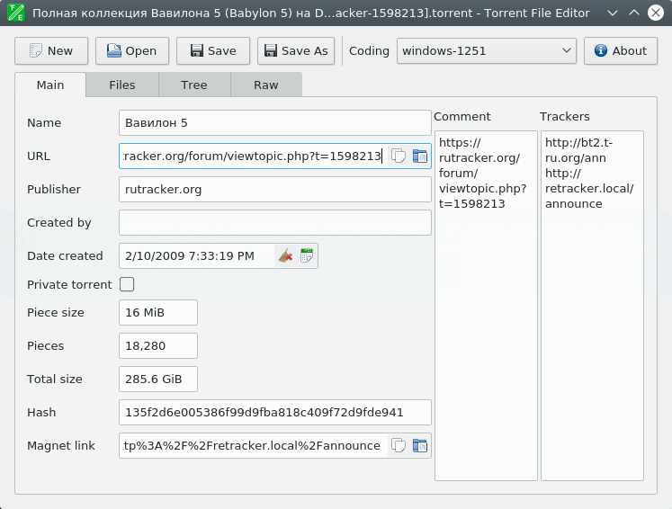
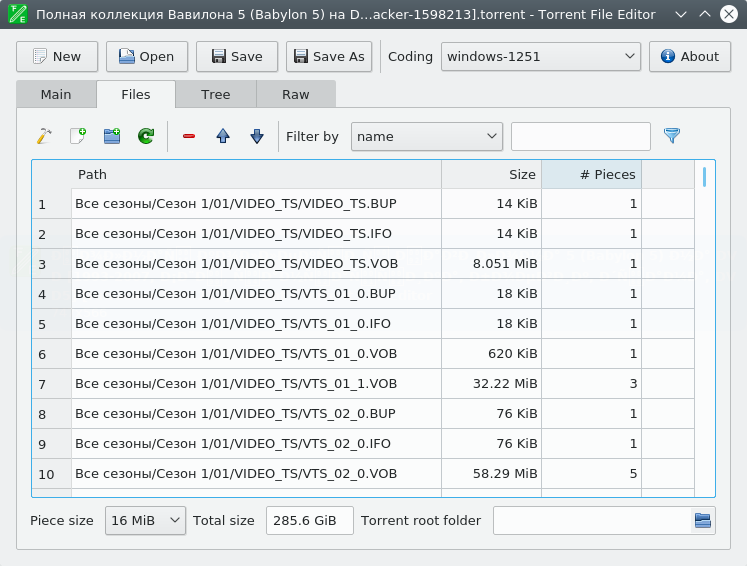
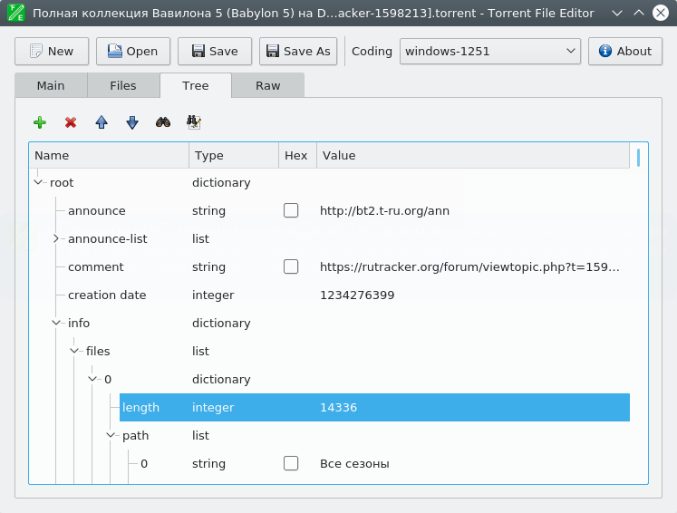
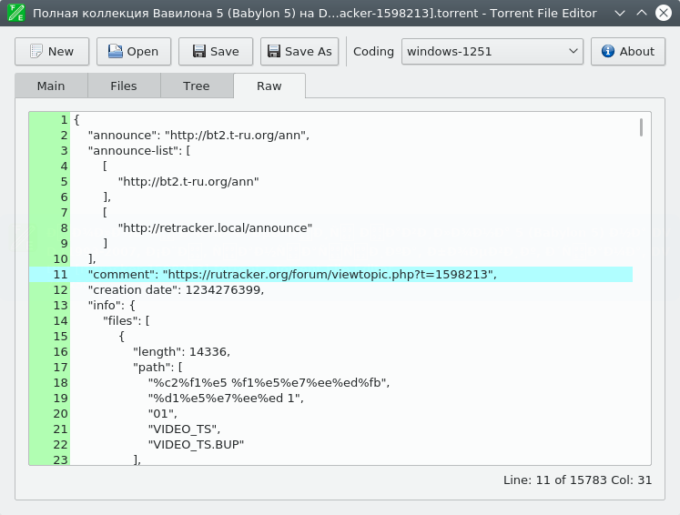

## Summary

Cross-platform application intended to create and edit .torrent and uTorrent .dat files. Replacement for [BEncode Editor](https://sites.google.com/site/ultimasites/bencode-editor) which has modern design and extra features.

## Screenshots

## Features

- Create .torrent file from a scratch.  
- Add new files to .torrent file.  
- Removing files from .torrent file.  
- Change files order in .torrent file.  
- Change main .torrent file infomation: name, comment, publisher, url, creation date, trackers and author.  
- Edit data as JSON-format. In this mode non-ASCII symbols not supported.  
- Translated to many languages.  
- Support different encodings.
- Portable.  
- Edit .torrent file as binary tree.  
- Search and replace in tree.  
- Open files with drag-n-drop.  
- Remove files from file list with filter.  
- Command line mode.

## Translations

 Arabic - العربية  
 Bengali - বাংলা  
 Simplified Chinese - 简化字  
 Traditional Chinese - 正體字/繁體字  
 Czech – Česky  
 Dutch - Nederlands  
 English - English  
 Finnish – Suomi  
 French – Français  
 German – Deutsch  
 Hebrew - עברית‎  
 Hungarian - Magyar  
 Indonesian – Bahasa Indonesia  
 Italian – Italiano  
 Japanese - 日本語  
 Korean - 조선말, 한국어  
 Polish – Polski  
 Brazilian Portuguese – Português brasileiro  
 Romanian - Română  
 Russian - Русский  
 Spanish – Español  
 Turkish – Türkçe  
 Vietnamese - Việtnam  

## Buy a beer to developer 

&ensp;Z986009119917&ensp;&ensp;R131648522366

